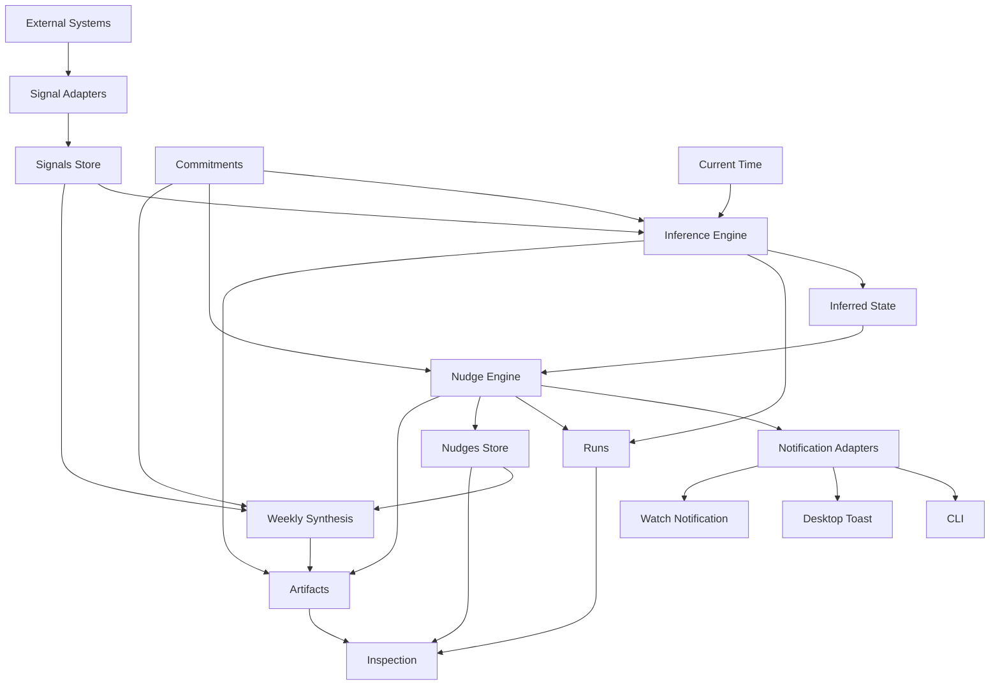
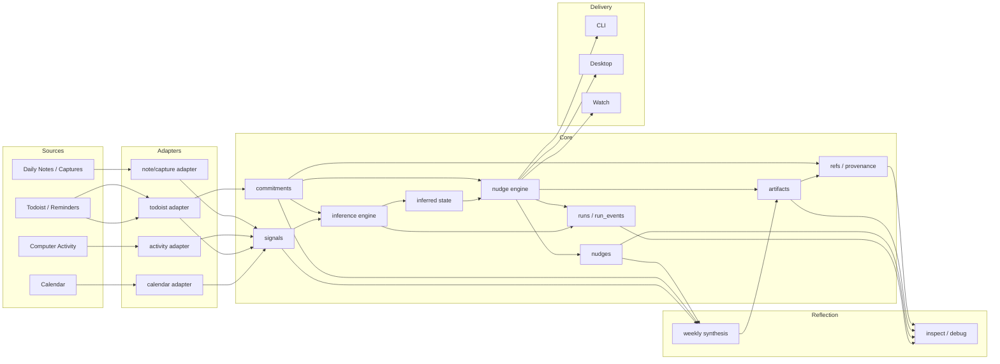
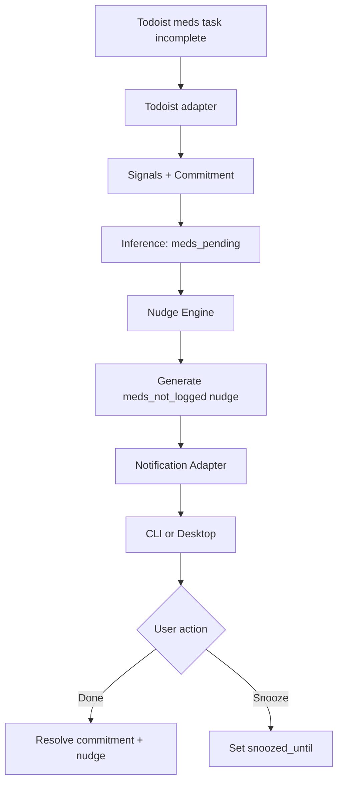
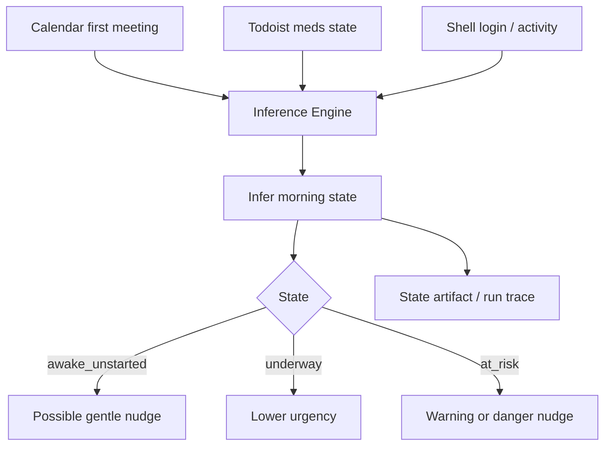
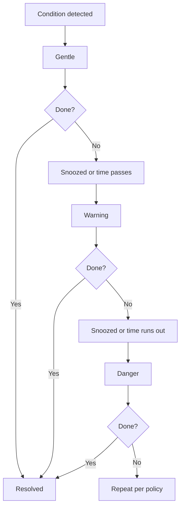
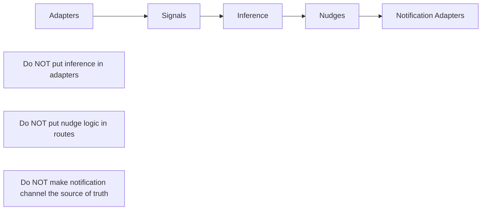

# vel — Architecture Diagram (Signals → Inference → Nudges → Artifacts)

This diagram is intended to accompany `vel_next_phase_instructions.md`.

It gives the coding agent a compact visual model of the **next implementation phase** so the system is built as a coherent pipeline rather than as disconnected features.

---

## High-level flow



---

## Concrete subsystem model



---

## First implementation slice

The first end-to-end slice should be exactly this:



This slice proves:

- external ingestion
- commitment linkage
- inference
- nudge generation
- done/snooze protocol
- persistence of state changes

If this slice works, the rest of the system can be built by extension rather than reinvention.

---

## Morning-state-focused slice



The morning state machine should be treated as a **derived model** built from the three agreed signal sources:

- calendar
- task completion
- workstation activity

Do not introduce additional ambient sensors until this version is working.

---

## Nudge escalation ladder



The escalation ladder should be:

- time-proximity-based
- confidence-aware
- consequence-aware

The system should **not** escalate merely because a timer expired. It should escalate because the cost of inaction is increasing.

---

## Important design boundaries



### Translation into engineering rules

- Adapters only normalize external data
- Inference engine owns interpretation
- Nudge engine owns prompting/escalation
- Notification adapters only deliver
- Runs/artifacts/refs preserve observability

---

## Practical engineering rule

If a feature does not fit this pipeline:

```text
source → signal → inference → nudge or artifact → inspection
```

it probably does not belong in this phase.

That rule should help prevent scope creep while the dogfooding version is being built.

---

## Short version for the coding agent

Build this in order:

1. adapters
2. signals store
3. commitments linkage
4. inference engine
5. nudges
6. notification adapters
7. artifacts + synthesis
8. inspection/debugging

That is the whole machine.